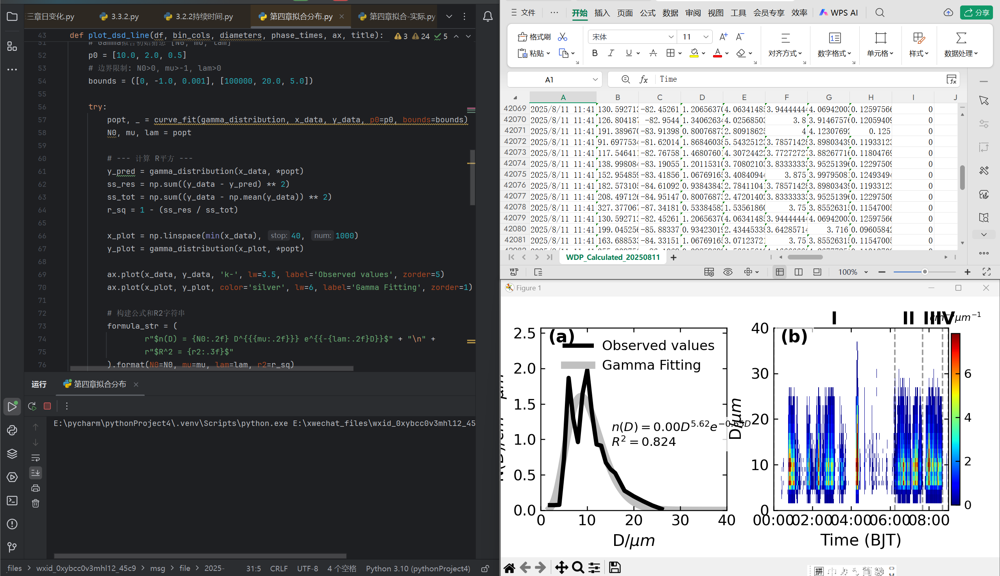

# FogMicro-AI-Agent

FogMicro-AI-Agent is an AI-driven multi-agent system designed for automated analysis of fog microphysical observations, with a focus on mountain fog environments.

---

## 🚩 Problem

Traditional fog microphysics research relies heavily on manual workflows, including:
- Droplet spectrum preprocessing
- Microphysical parameter calculation (LWC, Nd, Effective Radius)
- Statistical modeling and parameterization

These processes are time-consuming, fragmented, and difficult to reproduce.

---

## ⚙️ Solution: Multi-Agent Scientific Workflow

This project implements an AI-driven multi-agent system to automate the full research pipeline:

### 🧠 Planner Agent
- Decomposes research tasks into multi-step workflows  
- Enables long-chain scientific reasoning  

### 📊 Data Agent
- Performs quality control and preprocessing of droplet spectrum data  
- Handles bin alignment and time synchronization  

### 🌫️ Physics Agent
- Computes key microphysical parameters:
  - Liquid Water Content (LWC)
  - Droplet Number Concentration (Nd)
  - Effective Radius (Re)
  - Spectral width  

### 📈 Modeling Agent
- Performs curve fitting (power-law, exponential relationships)  
- Automatically selects optimal parameterization schemes  

### ✍️ Writing Agent
- Generates publication-ready scientific descriptions  
- Provides mechanism analysis and result interpretation  

---

## 🔁 Workflow

Raw Spectrum Data  
→ Quality Control  
→ Microphysical Calculation  
→ Parameterization Modeling  
→ Scientific Output  

---

## 📊 Application

Applied to fog observations during the 2025 monsoon season in Motuo:

- ⏱️ Efficiency improved by **70%+**  
- 📉 Modeling time reduced from **days to hours**  
- 🔁 Fully reproducible scientific workflow  

---

## 🤖 Key Features

- Multi-agent collaboration  
- Long-chain reasoning  
- Closed-loop modeling and validation  
- AI-assisted scientific writing  

---

## 📌 Status

Actively used in atmospheric science research.

### 🔁 Workflow Demo

